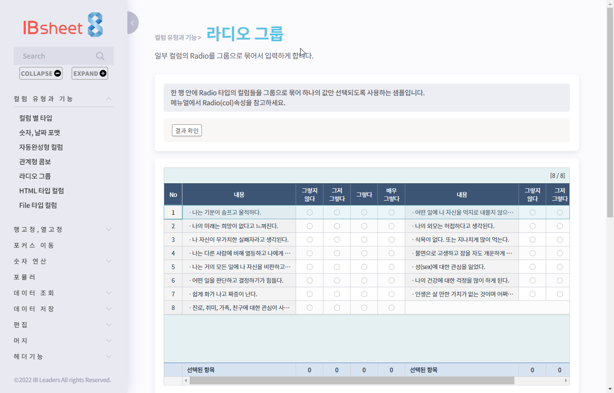
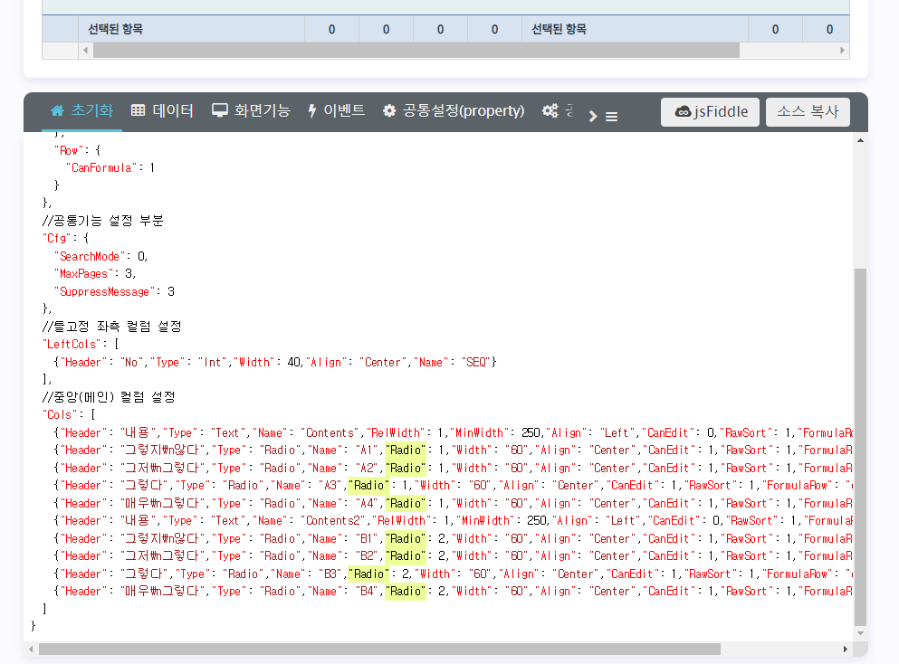
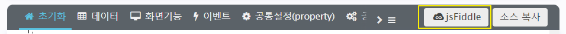
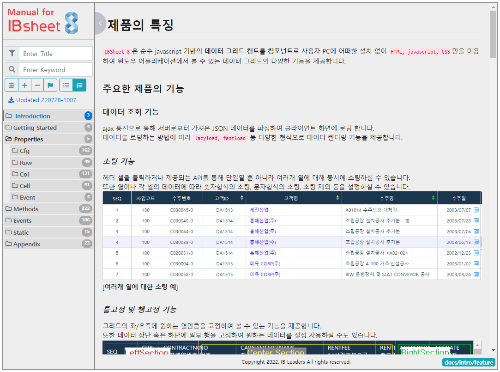
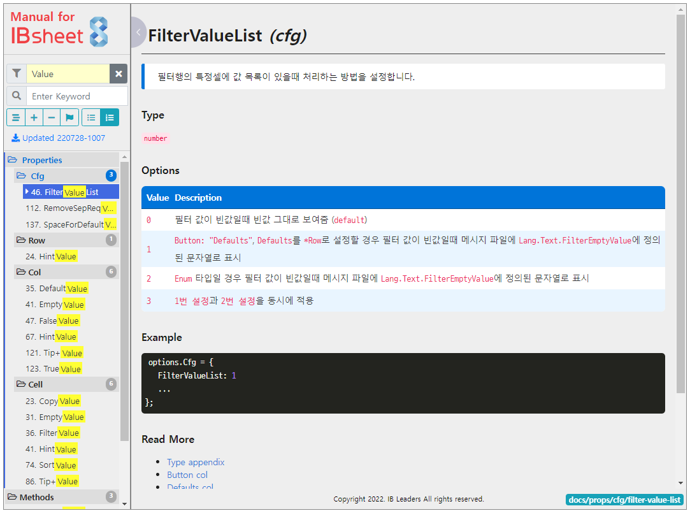
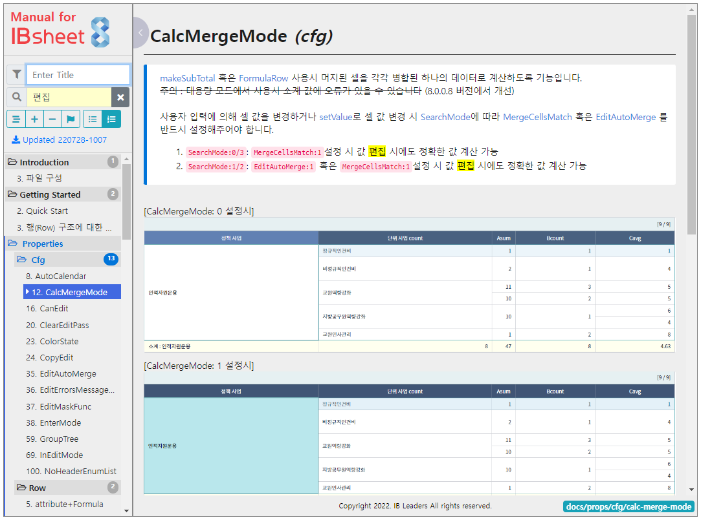
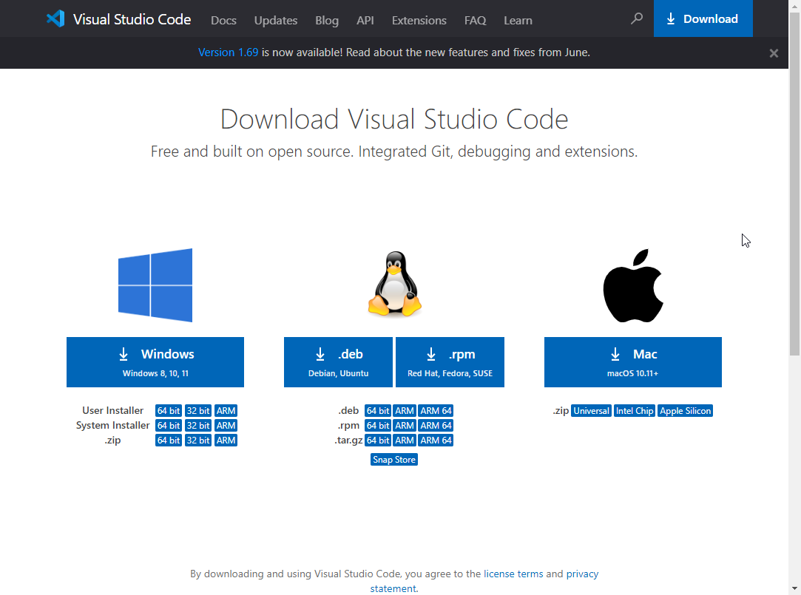
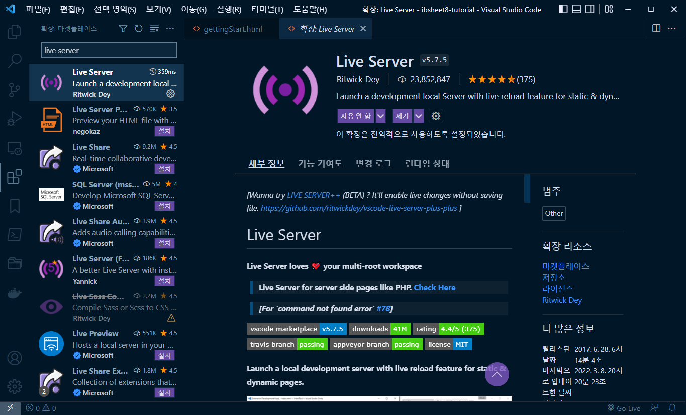
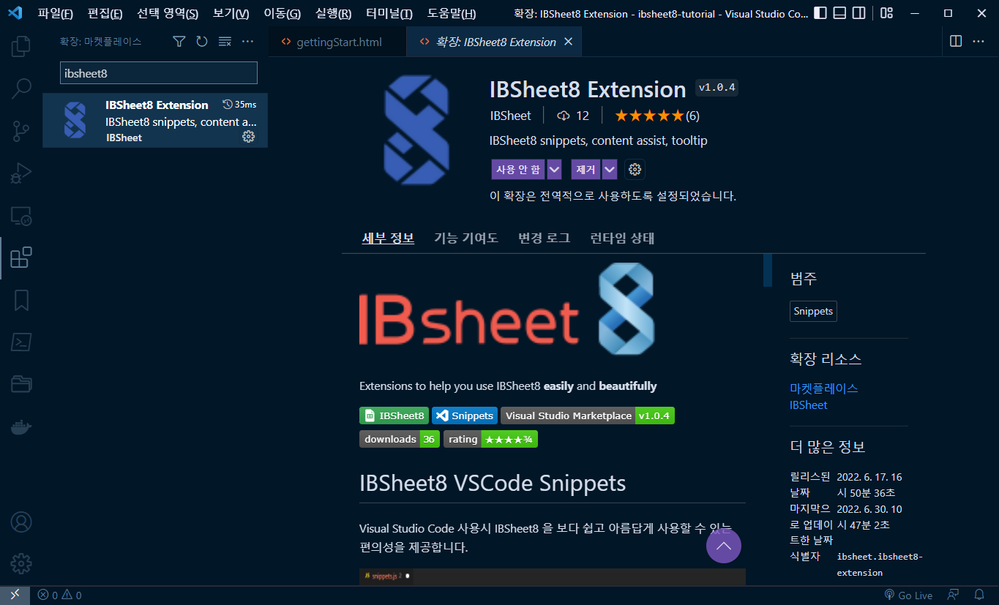

# 1. IB Sheet8 제품 소개

## 예제 사이트 소개
다음 URL에 접속하여 제품의 예제를 확인 할 수 있습니다.
  - URL : https://demo.ibleaders.com/ibsheet/v8/samples/customer-sample/html/main.html
  
 

1) 좌측의 메뉴를 통하여 관련된 예제를 확인해 볼 수 있습니다.
2) 하단의 텝을 해당 예제시트를 생성하는 로직과 데이터, 기능을 확인할 수 있습니다. 
*시트의 초기화 설정을 보면 해당 예제에서 알려주고자 하는 기능과 관련된 속성이 <mark>하이라이트</mark> 됩니다.*
 
3) jsFiddle 버튼을 클릭하시면 jsFiddle.com에서 예제를 직접 수정해 볼 수 있습니다.
 

## 온라인 메뉴얼 소개
다음 URL에 접속하여 제품의 메뉴얼을 확인 할 수 있습니다.
 - URL : https://docs.ibleaders.com/ibsheet/v8/manual
 

 1) 타이틀 검색 
 특정 함수나 이벤트 명을 알고 있는 경우, 타이틀 검색을 통해 찾으실 수 있습니다. 
  
 2) 키워드 검색
 메뉴얼 전체에서 특정 키워드를 포함하는 모든 컨텐츠가 검색됩니다. 
  

 온라인 메뉴얼은 주기적으로 업데이트 됨으로 개발시 가급적 온라인 메뉴얼을 참고하실 것을 권해드립니다.

 ## 개발환경 소개

 ### vscode 설정
 다음 URL에 접속하시어 vscode를 다운로드 받습니다.
- URL : https://code.visualstudio.com/download
 

설치된 vscode 프로그램에 교육을 위한 플러그인을 설치합니다.
- Live Server 
 
- IB Sheet8 Extension 
 

