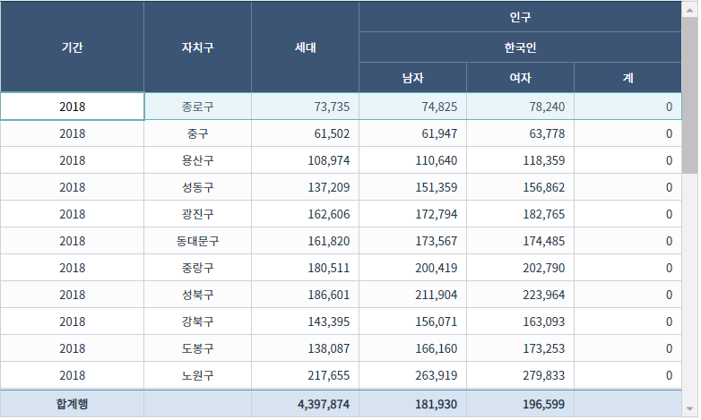
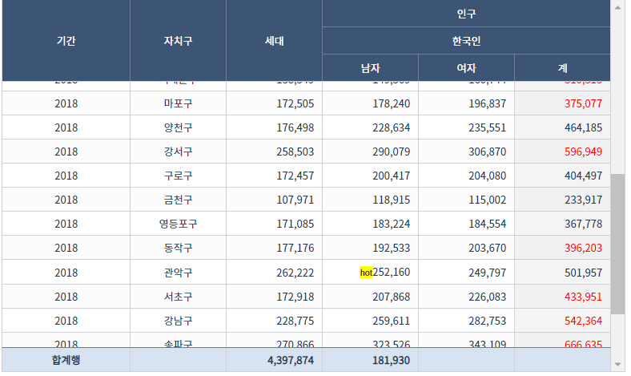

# 6. Def 와 Formula
## Def 기능 이해
시트 초기화시 options 설정에 Def 속성을 통해 시트의 모든 열이나 행에 공통적인 기능을 손쉽게 설정할 수 있습니다.
```js
var OPT = {
    Def: {
        Row:{}, // 모든행에 동일한 기능을 설정
        Col:{}, // 모든 열에 동일한 기능을 설정
        Header:{} // 헤더행에 동일한 기능을 설정
    },
    Cfg:{},
    Cols:[...]
}
IBSheet.create({
    id: "mySheet",
    el: "sheetEl",
    options: OPT
});
```

Def.Col에서 설정한 속성값과 Cols에서 설정한 값이 다른 경우에는 Cols에서 설정한 값이 우선됩니다.

```js
var OPT = {
    Def: {
        Col:{
            CanEdit: 0 // 모든 열 편집 불가
        }, 
    },
    Cfg:{},
    Cols:[
        {Header:"기체명", Name: "OBJNM", Type:"Text", CanEdit:1 }, //편집이 가능
        {Header:"기체코드", Name: "OBJCD", Type:"Text"}, //편집 불가
        ...
    ]
}
IBSheet.create({
    id: "mySheet",
    el: "sheetEl",
    options: OPT
});
```

Def.Row 와 Def.Col 에서 같은 속성에 대해 다른 값이 설정되는 경우에는 Def.Row 값이 설정됩니다.

시트에서 행,열,셀 에 각각 동일한 속성 설정시 수선순위는 아래와 같습니다.
```
Cell설정 > Row설정 > Col 설정  (좌측이 우선순위가 높음)
```


## Formula 기능
### 1. 하단 합계행(FormulaRow) 사용하기

(Col)FormulaRow 속성을 이용하여 데이터 하단에 합계나 평균,최대값,최소값등을 표시할 수 있습니다.


|예약어|Description|
|-----|-----|
|'Sum'|열의 합계값|
|'Avg'|열의 평균값|
|'Max'|열의 최대값|
|'Min'|열의 최소값|
|'Count'|행의 개수|
|그 외의 문자|합계행에 그대로 표시|
|function 객체|사용자 정의 함수 구현|


FormulaRow 속성 사용 예)
```html
<div id="sheetEl2" style="width:100%;height:500px"></div>
<script>
var targetGu = ["종로구","용산구"];
var mySum = function(fr){
    // 2018년도 종로구,용산구에 해당하는 여성의 합
    return fr.Sheet.getDataRows().reduce( (a, c)=>{
        if(c["Year"]==2018){
            if(targetGu.includes(c["Region"])){
                a += c["KoFemale"];
            }
        }
        return a;  
    },
    0);
}
IBSheet.create({
    id: "mySheet2",
    el: "sheetEl2",
    options: {
        Cfg:{
            HeaderMerge:3
        },
        Cols:[
            {Header: ["기간","기간","기간"],Type: "Text",Name: "Year",Width: "160",Align: "Center", FormulaRow:"합계행"},
            {Header: ["자치구","자치구","자치구"],Type: "Text",Name: "Region",Width: "120",Align: "Center"},
            {Header: ["세대","세대","세대"],Type: "Int",Name: "Generation",Width: "120", FormulaRow:"Sum"},
            {Header: ["인구","한국인","남자"],Type: "Int",Name: "KoMale",Width: "120", FormulaRow:"Avg"},
            {Header: ["인구","한국인","여자"],Type: "Int",Name: "KoFemale",Width: "120", FormulaRow:mySum},
            {Header: ["인구","한국인","계"],Type: "Int",Name: "KoTotal",Width: "120"}
        ]
    },
    data:[
        {"Year": 2018, "Region": "종로구", "Generation": 73735, "KoMale": 74825, "KoFemale": 78240 },
        {"Year": 2018, "Region": "중구", "Generation": 61502, "KoMale": 61947, "KoFemale": 63778 },
        {"Year": 2018, "Region": "용산구", "Generation": 108974, "KoMale": 110640, "KoFemale": 118359 },
        {"Year": 2018, "Region": "성동구", "Generation": 137209, "KoMale": 151359, "KoFemale": 156862 },
        {"Year": 2018, "Region": "광진구", "Generation": 162606, "KoMale": 172794, "KoFemale": 182765 },
        {"Year": 2018, "Region": "동대문구", "Generation": 161820, "KoMale": 173567, "KoFemale": 174485 },
        {"Year": 2018, "Region": "중랑구", "Generation": 180511, "KoMale": 200419, "KoFemale": 202790 },
        {"Year": 2018, "Region": "성북구", "Generation": 186601, "KoMale": 211904, "KoFemale": 223964 },
        {"Year": 2018, "Region": "강북구", "Generation": 143395, "KoMale": 156071, "KoFemale": 163093 },
        {"Year": 2018, "Region": "도봉구", "Generation": 138087, "KoMale": 166160, "KoFemale": 173253 },
        {"Year": 2018, "Region": "노원구", "Generation": 217655, "KoMale": 263919, "KoFemale": 279833 },
        {"Year": 2018, "Region": "은평구", "Generation": 205001, "KoMale": 233702, "KoFemale": 249495 },
        {"Year": 2018, "Region": "서대문구", "Generation": 138549, "KoMale": 149569, "KoFemale": 160744 },
        {"Year": 2018, "Region": "마포구", "Generation": 172505, "KoMale": 178240, "KoFemale": 196837 },
        {"Year": 2018, "Region": "양천구", "Generation": 176498, "KoMale": 228634, "KoFemale": 235551 },
        {"Year": 2018, "Region": "강서구", "Generation": 258503, "KoMale": 290079, "KoFemale": 306870 },
        {"Year": 2018, "Region": "구로구", "Generation": 172457, "KoMale": 200417, "KoFemale": 204080 },
        {"Year": 2018, "Region": "금천구", "Generation": 107971, "KoMale": 118915, "KoFemale": 115002 },
        {"Year": 2018, "Region": "영등포구", "Generation": 171085, "KoMale": 183224, "KoFemale": 184554 },
        {"Year": 2018, "Region": "동작구", "Generation": 177176, "KoMale": 192533, "KoFemale": 203670 },
        {"Year": 2018, "Region": "관악구", "Generation": 262222, "KoMale": 252160, "KoFemale": 249797 },
        {"Year": 2018, "Region": "서초구", "Generation": 172918, "KoMale": 207868, "KoFemale": 226083 },
        {"Year": 2018, "Region": "강남구", "Generation": 228775, "KoMale": 259611, "KoFemale": 282753 },
        {"Year": 2018, "Region": "송파구", "Generation": 270866, "KoMale": 323526, "KoFemale": 343109 },
        {"Year": 2018, "Region": "강동구", "Generation": 177247, "KoMale": 211816, "KoFemale": 215757 },
        {"Year": 2017, "Region": "종로구", "Generation": 73594, "KoMale": 75967, "KoFemale": 78803 },
        {"Year": 2017, "Region": "중구", "Generation": 60412, "KoMale": 62253, "KoFemale": 63456 }
  ]
});
</script>
```
<br>


<br>

### 2. 열과 열의 계산(Formula) 사용하기
(Col)Formula 속성을 통해 열의 계산된 값을 표시할 수 있습니다.<br>
열과 열의 계산식을 string형식으로 설정하거나 callback함수로 설정할 수 있습니다.<br>

**주의**<br>
Formula 속성 사용시에는 반드시 <mark>Def.Row.CanFormula</mark> 와 <mark>Def.Row.CalcOrder</mark>를 설정해야 합니다.<br>

[Appendix - Formula](https://docs.ibleaders.com/ibsheet/v8/manual/#docs/appx/formula) 내용을 참고해 주세요.

```js
IBSheet.create({
    id: "mySheet",
    el: "sheetEl",
    options: {
        Cfg:{
            HeaderMerge:3
        },
        Def:{
            Row:{
                CanFormula: 1,  // Formula 사용 여부
                CalcOrder: "KoTotal" // Formula가 적용된 컬럼명 (여러개 컬럼인 경우 ,로 구분)
            }
        },
        Cols:[
            ...
            {Header: ["인구","한국인","계"],Type: "Int",Name: "KoTotal",Width: "120", Formula: "KoMale+KoFemale"},
        ]
    },
    data:[
        ...
  ]
});

```


### 3. 속성 Formula(attribute+Formula) 사용하기

열의 값이나 계산 결과에 따라 셀의 배경색이나 편집 여부와 같은 속성을 자동으로 변경할 수 있습니다.<br>
열 생성시 "속성명Formula" 형식으로 속성을 정의하여 사용합니다.<br>

**주의**<br>
Formula와 마찮가지로  <mark>Def.Row.CanFormula</mark>를 설정해야하고, <mark>Def.Row.CalcOrder</mark> 속성에 "열이름속성명"형식으로 계산 순서를 정의해야 주어야 합니다.

```js
const tfunc = function(fr){
    return fr.Row["Generation"] > fr.Row["KoMale"] ? "<mark style='font-size:7px'>hot</mark>" : "";
}
IBSheet.create({
    ...
    options: {
        Def:{
            Row: {
                CanFormula: 1,
                CalcOrder: "KoTotal,KoMaleHtmlPrefix,KoTotalTextColor" // 계산 순서대로 정의
            }
        },
        Cols:[
            {Header: ["기간","기간","기간"],Type: "Text",Name: "Year",Width: "160",Align: "Center", FormulaRow:"합계행"},
            {Header: ["자치구","자치구","자치구"],Type: "Text",Name: "Region",Width: "120",Align: "Center"},
            {Header: ["세대","세대","세대"],Type: "Int",Name: "Generation",Width: "120", FormulaRow:"Sum"},
            {Header: ["인구","한국인","남자"],Type: "Int",Name: "KoMale",Width: "120", HtmlPrefixFormula: tfunc},
            {Header: ["인구","한국인","여자"],Type: "Int",Name: "KoFemale",Width: "120"},
            {Header: ["인구","한국인","계"],Type: "Int",Name: "KoTotal",Width: "120", Formula: "KoMale+KoFemale", TextColorFormula:"KoFemale/KoMale>1.05?'#FF0000':''"}
        ]
    },
```

